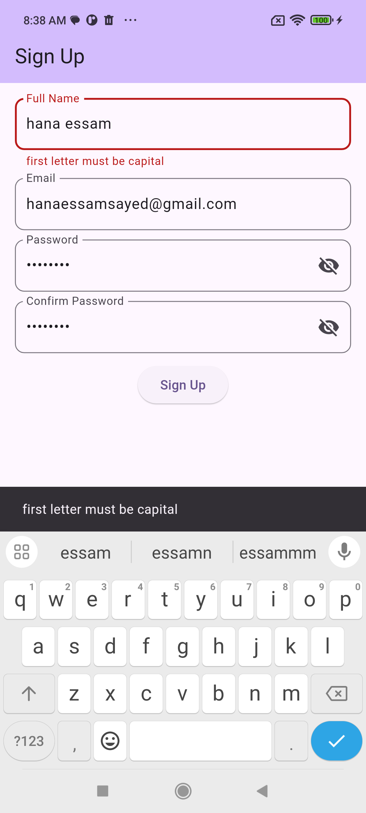

## Flutter Fundamentals - Widgets - Create simple shopping app interface

# A simple shopping app
 This is a simple shopping app with a sign up form 
 the form checks for full name, email, password  and confirm password field
 and validate each value in it before navigating to the shopping page.

 The shopping page contains a view for our products
 a grid view for all products
 and a list with out hot offers

 # Project files

 shopping_page.dart ->  represents widgets that has all the shopping page components 

 sign_up_page.dart -> contains the sign up form and validations

 page_animations.dart -> contains animation for the sign up page to fade out and the shopping page to fade in.

 main.dart -> where you can launch the app

 ## Added Localization 
  

 # screenshots

      