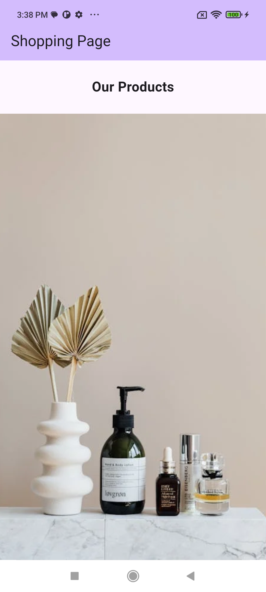

## Flutter Fundamentals - Widgets - Create simple shopping app interface

**Task General Description:**

"create a simplified version of a shopping app interface using Flutter.  
This app will feature a main screen with multiple sections, displaying products, hot offers and recently purchased products "

**Requirement 1:**

_**"Title: create stateful widget**_  
Description : 1:use media query to design responsive UI.  
2.give a title to the page using appBar  
3.place at the start of the page text says ""our products"" below it a pageView that shows images of the products  
4.place gridView that display 2 cards in the single row of the gridView these cards shows  
text , image and add to cart icon (make sure when the icon is tapped to display  
snackbar that says item added to the cart)  
5. below the gridView add a text says ""hot offers"" and using ListView builder build a list of 5 items with images  
and text inside it use expanded widget for both images and text.  
6.make sure that the page is scrollable horizontally."

**Screenshots of output**
  

